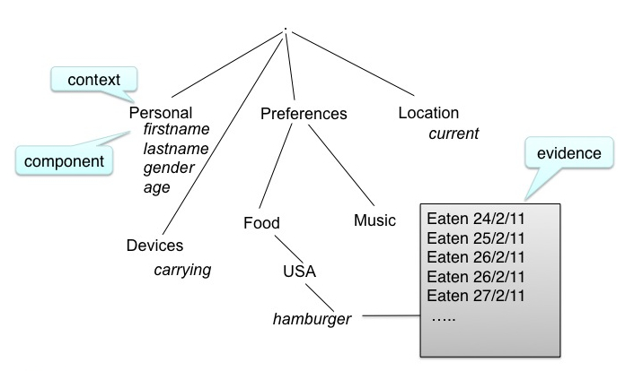

Introduction
============

  * User Models as first class citizens

    * independant of a particular application
    * not just fragments of me locked away in individual systems
    * may be distributed over machines I use or in the cloud (could be a personal cloud)

  * Scutability and user control
  
    * I own my model
    * I control what goes in
    * I control what goes out (releasing parts to applications)
    * I can see my model in meaningful forms

  * as new evidence about an aspect is available an application (evidence source) *tells* the user model
  * the user model *accretes* the evidence
  
    * a times stamp is added
    * the source (registered name of the application) is added
    * the evidence type (explicit,...) is added
    * the evidence is appended to a list associated with a component of the model

Resolution:

  * When an application needs to know information from the model, it asks the model for the value of the required set of components, it *asks* the model for the required set of components
  * At that time
  
    * A filter selects the evidence allowed to the asker
    * A resolver function interprets the allowed evidence
    
      * the application may specify the resolver function (from those allowed)
      * Or use default
      * Can be very simple (eg Point Query) or arbitrarily sophisticated (eg use Bayesian model, ontology.)

  * Embrace inconsistency, multiple interpretations!

Scrutability:

Definition:
	Capable of being understood through study and observation, comprehensible. 
	(www.thefreedictionary.com/scrutable)

	Understandable upon close examination. (www.tiscali.co.uk/reference/dictionaries/difficultwords/data/d0011288.html)

  * the Personis Framework is designed for scrutability
  
    * Why did the system adapt that way?
    * Where does the system think I am, and why?
    * Historic queries: what location did the system think I was on May 1st 2001?
    * what music does the system think I like and why?

Model Structure:

  * the model is represented as a tree
  * we call the branches *contexts* and the leaves *components*

.. image:: model-tree.jpg

Atomic modelled unit - component:

The components of a model contain the evidence associated with that attribute. Example components:

  * for classic user model:
  
    * knowledge 
    * beliefs
    * preferences
  * for pervasive computing:
  
    * attributes (eg weight, location, sensor reading)
    * qualifiers for knowledge and attributes
    * goals (eg I want to be able to do 10 chin-ups)

Operation: 
	tell

  * evidence is accreted by components after the *tell* operation

Operation:
	ask

  * A component value is retrieved from the nodel using an *ask* operation
  
    * the evidence is *resolved* by a resolver function to give the value

.. image:: resolution.jpg

Accretion/Resolution

  * values are only calculated from the evidence when they are needed, rather than whenever a new data point (evidence) is received
  * the choice of resolver function allows flexibility in the calculated values. For example, location may be resolved as:
  
    * room 123, or "at work", or latitude/longitude
  * historic queries are possible: where was I on a certain date, how have my music preferences changed.
  
